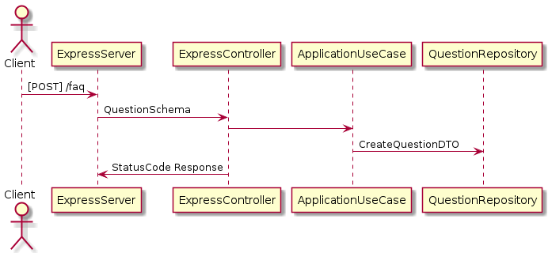

# Backend Challenge

This repo contains the code for an api that resolves the following problem:

> There's a landing page with a simple form, by default, the page will only have this simple form. Users can submit the form and the backend will receive this data, validate and saves it in a database.

## Prerequisites

You must have installed and configured in your machine the following resources:

- nvm [https://github.com/nvm-sh/nvm]
- docker [https://docs.docker.com/]
- docker-compose [https://docs.docker.com/compose/]

## Running local application (development)

- Setup the `.env` copying the respective dotenv file (dev)

```sh
cp ./docs/dotenv/.env.dev .env
```

- Install nodejs version used in the project

```sh
nvm install && nvm use
```

- Raise a PostgreSQL database with docker

```sh
npm run start:dev-database
```

- Build the project

```sh
npm run build
```

- If is the first time running the container, will be needed run migrations:

```sh
npm run migrate
```

- Start api in watch mode:

```sh
npm run start:dev
```

## Architecture Details

This app commonly uses some design patterns like Adapter, Singleton and Decorator. Also, is much used the Dependency Inversion Principle from SOLID and others concepts described by hexagonal and clean architecture.
If you are not familiar with this ideas, highly recommend check out the reference <a href="#reference">section</a>.

### Example of Ports and Adapter concept with the Clean Arch


## Main libraries functionality resume

- **ts-jest**: a runtime like `ts-node` used under the hood by jest
- **dotenv**: map dotenv configs to `process.env` javascript's global object
- **express**: minimalist and not opinionated web framework
- **pg**: postgreSQL driver used under the hood by ORM
- **tsyringe**: dependency injection library
- **typeorm**: ORM currently used
- **uuid**: uuid library used by an uuid adapter
- **jest**: testing framework
- **tsc-watch**: wrapper of `tsc` CLI to trigger scripts by events like "onSuccessful"
- **tsc-alias**: library to transpile the path mapping of typescript
- **eslint**: linter
- **prettier**: code formatter

## Contributing to the project

Husky improves the development blocking commits without:

- Lint
- Format
- Passing tests

Others tips to maintain the quality of project:

- Don't force commits with `no-verify` flag
- Always prefer use the typescript path mapping with imports like @layer/file.ts
- Don't break dependency rule between architecture layers

### Writing tests

This project uses [Jest](https://jestjs.io/) as testing framework.

- Tests are specified with this pattern: `**/*.spec.ts`
- You can setup more settings in `jest.config.ts`

### Documenting UML diagrams

This project uses PlantUML as main diagram tool, so the code and output image should be centralized when possible in the `docs/diagram` folder.
Example of feature design:



## Running the production version

- Setup the `.env` copying the respective dotenv file (now should be the prod version);

```sh
cp ./docs/dotenv/.env.prod .env
```

- Run the container orchestrator specifying the production version of `docker-compose.yml`

```sh
docker-compose -f docker/prod/prod.docker-compose.yml up --build
```

## Endpoint descriptions

You can use a REST client like Insomnia to make this requests. Check out `docs/rest-client-collections/insomnia`.

### **/faq**

- [GET] `/faq`
- Example of expected return:

```json
{
  "questions": [
    {
      "id": "86224de6-fc7e-4b2e-b204-312bdea7d610",
      "name": "Joao",
      "phone": "991220629",
      "email": "someemail@sad.com",
      "subject": "subject1",
      "message": "message",
      "createdAt": "2022-07-29T00:59:33.449Z"
    },
    {
      "id": "46cc79a4-8eb9-4ba6-b5be-ee21f0ede747",
      "name": "Joao",
      "phone": "991220629",
      "email": "someemail@sad.com",
      "subject": "subject2",
      "message": "message",
      "createdAt": "2022-07-29T00:59:45.130Z"
    },
    {
      "id": "059490e7-3517-4c29-9c91-9878ad5d9d18",
      "name": "Joao",
      "phone": "991220629",
      "email": "someemail@sad.com",
      "subject": "subject3",
      "message": "message",
      "createdAt": "2022-07-29T00:59:46.889Z"
    }
  ]
}
```

- [GET] `/faq?page=1&limit=2`
- Example of expected paginated return:

```json
{
  "questions": {
    "next": {
      "page": 2,
      "limit": 2
    },
    "data": [
      {
        "id": "86224de6-fc7e-4b2e-b204-312bdea7d610",
        "name": "Joao",
        "phone": "991220629",
        "email": "someemail@sad.com",
        "subject": "subject1",
        "message": "message",
        "createdAt": "2022-07-29T00:59:33.449Z"
      },
      {
        "id": "46cc79a4-8eb9-4ba6-b5be-ee21f0ede747",
        "name": "Joao",
        "phone": "991220629",
        "email": "someemail@sad.com",
        "subject": "subject2",
        "message": "message",
        "createdAt": "2022-07-29T00:59:45.130Z"
      }
    ]
  }
}
```

- [POST] `/faq`
- Example of schema expected:

```json
{
  "name": "Joao",
  "phone": "991220629",
  "subject": "subject15",
  "message": "message",
  "email": "someemail@asd.com"
}
```

This endpoint only returns some output if the status code is 400 (bad request).

- Example of errors:

```json
{
  "message": "invalid question",
  "errors": [
    {
      "field": "email",
      "description": "empty required field"
    },
    {
      "field": "message",
      "description": "empty required field"
    },
    {
      "field": "name",
      "description": "empty required field"
    },
    {
      "field": "subject",
      "description": "empty required field"
    },
    {
      "field": "phone",
      "description": "empty required field"
    }
  ]
}
```

```json
{
  "message": "invalid question",
  "errors": [
    {
      "field": "name",
      "description": "name exceeds 14 characters"
    },
    {
      "field": "subject",
      "description": "subject exceeds 100 characters"
    },
    {
      "field": "phone",
      "description": "The phone number must contain only numbers and 9 digits"
    }
  ]
}
```

## Reference

- Design patterns: https://refactoring.guru
- Architecture: https://herbertograca.com/2017/11/16/explicit-architecture-01-ddd-hexagonal-onion-clean-cqrs-how-i-put-it-all-together/
